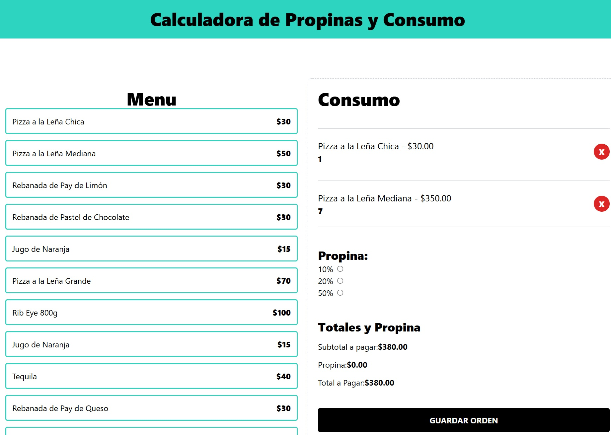

Proyecto que se encarga de cargar una orden, seleccionando el porcentaje de propina deseada.
Realizado utilizando Typescript para el tipado de datos, UseReducer para el manejo de las acciones y estados y Tailwindcss para los estilos

